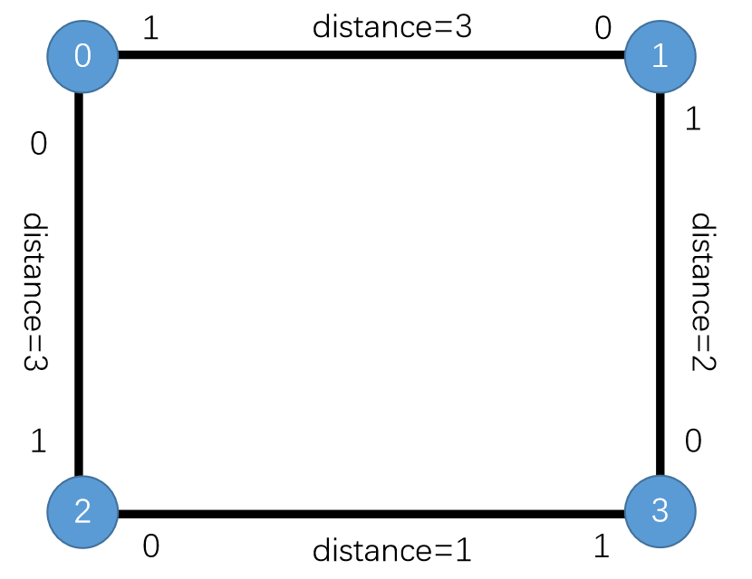
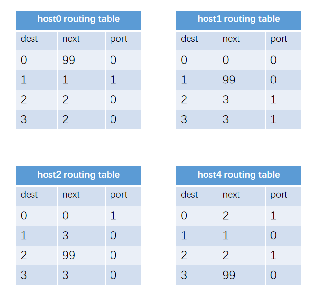

# communication_protocol_design
## Designed by Team Enet in UESTC, 12/2018
### 1.Introduction of Function
In this project, we realized a net protocol with C/C++, and a picture data tranfering module based on BASE64 coding. We test this protocol with transfering a picture through a circle-topology network with multiple host nodes.
### 2.Topology Design

### 3.Expecting Routing Table

### 4.Environment
Visual Studio 2017
### 5.Project Test Video
[![Watch the video]](https://youtu.be/JhXMN-o4q9o)
